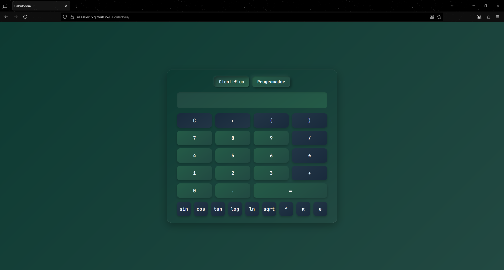

# Calculadora Científica y Programador

## Descripción Breve
Una calculadora web interactiva con dos modos: científico para operaciones matemáticas avanzadas y programador para conversiones entre bases numéricas (decimal, binario, octal y hexadecimal). Desarrollada con tecnologías web puras para un uso simple y responsive.

## ¿Qué es el Proyecto?
Calculadora científica en la web con soporte para modo programador. Es una aplicación estática que simula una calculadora física, permitiendo cálculos complejos y conversiones de bases sin necesidad de instalaciones adicionales.

## ¿Para Qué Sirve?
Sirve para realizar operaciones matemáticas básicas y científicas de manera rápida, así como para convertir números entre diferentes sistemas de numeración (útil para programadores y desarrolladores). Incluye soporte para teclado y animaciones suaves al cambiar modos.

## Demo o Captura de Pantalla

**Link de Demo:** https://eliassxv16.github.io/Calculadora/

**Imagen de Cómo se Ve:**

## Características Principales
- **Operaciones Básicas:** Suma (+), resta (-), multiplicación (*), división (/), potencia (^), paréntesis y punto decimal (.).
- **Operaciones Científicas:** Funciones trigonométricas (sin, cos, tan en grados), logaritmo base 10 (log), logaritmo natural (ln), raíz cuadrada (sqrt), constantes π y e.
- **Modo Programador:** Conversión entre bases decimal (DEC), binario (BIN), octal (OCT) y hexadecimal (HEX). Input validado por base (e.g., solo 0-1 en binario, A-F en hexadecimal). Botones dedicados para letras A-F en HEX. Operaciones aritméticas se realizan en decimal y se muestran en la base actual.
- **Modos de Uso:** Selector de modos ("Científica" y "Programador") con animaciones suaves (fade y slide). El modo activo se resalta con un efecto visual.
- **Interfaz:** Soporte para clics en botones y teclado (números, operadores, funciones). Display readonly que muestra la entrada y resultados. Efectos hover y active para interactividad.
- **Otras Funciones:** Limpiar (C), retroceso (←), equals (=) que calcula el resultado. No incluye historial de operaciones ni graficador (puede añadirse en futuras versiones).

## Instalación y Uso
### Requisitos
- Un navegador moderno (Chrome, Firefox, Edge, Safari) con soporte para HTML5, CSS3 y JavaScript (ES6+).
- No requiere Node.js, servidores o dependencias externas; es una app estática.

### Pasos para Clonar y Correr el Proyecto
1. Descarga o clona la carpeta del proyecto (Calculadora) a tu PC.
2. Abre la carpeta en un editor de código como VS Code (opcional).
3. Abre el archivo `index.html` en tu navegador preferido (doble clic o arrastrar al navegador).
4. ¡Listo! Usa los botones o el teclado para calcular. Cambia modos con los botones superiores.

## Explicación Técnica
### Tecnologías Usadas
- **HTML5:** Estructura de la interfaz (divs para display, grids/flex para botones, botones interactivos).
- **CSS3:** Estilos con gradientes lineales, sombras (box-shadow para efectos hover/active y neumorphism selectivo en modos), transiciones suaves (transition para animaciones), y layout responsive (flexbox y grid).
- **JavaScript Puro (Vanilla JS):** Lógica de interacción (event listeners para clics y teclado), manejo de estado (variables para entrada actual, operador, modo, base), cálculos (usando objetos Math de JS como sin, cos, log, pow) y conversiones de bases (parseInt con radix y toString con base).

No usa frameworks como React o librerías externas; todo es nativo para simplicidad y rendimiento.

### Cómo Está Organizado el Código
- **index.html:** Estructura principal. Incluye el contenedor de la calculadora, display (input readonly), selector de modos (botones Científica/Programador), grid de botones básicos (números, operadores), sección de botones científicos (sin, cos, etc.) y sección de botones programador (DEC, BIN, OCT, HEX, A-F; oculta inicialmente).
- **styles.css:** Estilos globales (tema verde oscuro con gradientes), clases para botones (colores por tipo: verde para números, azul oscuro para operadores/funciones), animaciones de modo (opacity/transform), y fuente JetBrains Mono para consistencia monospace.
- **script.js:** Lógica completa. Variables globales para estado (entradaActual, modoActual, baseActual). Funciones para actualizar pantalla, manejar input (botones/teclado), calcular (switch para operadores), funciones científicas (Math.sin, etc.), cambiar modos (show/hide secciones con animaciones), y conversiones de bases (parseInt/toString con validación de dígitos).

### Breve Explicación de Cómo Funciona el Cálculo
En modo programador, el input se valida por base (e.g., solo dígitos válidos), se convierte a decimal internamente con `parseInt(entrada, obtenerRadix(base))`, se realizan cálculos en decimal, y el resultado se muestra en la base actual con `resultado.toString(obtenerRadix(base))`. Los modos preservan valores convirtiéndolos al cambiar (e.g., de decimal a binario). No usa `eval()` para seguridad; todo es parsing manual y Math.

¡Contribuciones bienvenidas! Abre un issue o pull request en el repositorio.
